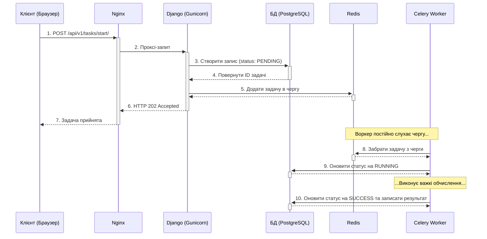
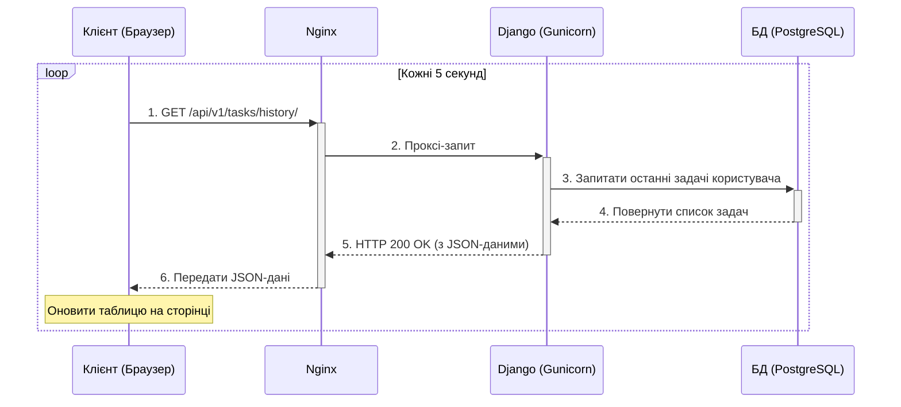

# Веб-застосунок для трудомістких обчислень

Django + Celery + Redis + PostgreSQL + Nginx (з HTTPS)


## 🏗️ Архітектура

Архітектура системи розкривається через дві ключові діаграми послідовності, які показують взаємодію компонентів у часі.


                                ┌──────────────────────────────────────────────┐
                                │                                              │
                                │               Клієнт (Browser)               │
                                │                                              │
                                │                                              │
                                └───────────────┬──────────────────────────────┘
                                                │  HTTPS (TLS)
                                                ▼
                                        ┌─────────────────┐
                                        │     NGINX       │
                                        │                 │
                                        │                 │
                                        │                 │
                                        └────────┬────────┘
                                                 │ HTTP (internal Docker net)
                                                 ▼
                         ┌────────────────────────────────────────────────────┐
                         │                      Django                        │
                         │                                                    │
                         │                                                    │
                         └────────────────────────┬───────────────────────────┘
                                                  │
                                                  │
                                                  │                              
                                                  ▼                              
                ┌────────────────────────────────────────────────────────────────────────┐
                │                                REDIS                                   │
                │                              Черга завдань                             │
                │                                                                        │
                │                                                                        │      
                │                                                                        │      
                └───────────┬────────────────────────────────────────────────────────────┘       
                            │  
                            ▼
                  ┌────────────────────────┐          ┌────────────────────────┐
                  │     Celery Worker 1    │          │     Celery Worker 2    │
                  │  hostname=worker1      │          │  hostname=worker2      │
                  │  concurrency=1         │          │  concurrency=1         │
                  │  acks_late=True        │          │  acks_late=True        │
                  └──────────┬─────────────┘          └────────────────────────┘
                             │ 
                             ▼
                        ┌──────────────────────┐
                        │     PostgreSQL       │
                        │  Table Calculation   │
                        │  (id, status,        │
                        │   precision,         │
                        │   result_data,       │
                        │   timestamps ...)    │
                        └──────────┬───────────┘
                                   │
                                   ▼
                            Клієнт GET /history/


### Сценарій 1: Запуск нового обчислення

Ця діаграма показує повний шлях запиту від клієнта до моменту, коли задача успішно виконана воркером.



### Сценарій 2: Оновлення статусу на сторінці

Ця діаграма ілюструє, як кожні 5 секунд фронтенд отримує актуальні дані про задачі.



## 🚀 Швидкий старт (Docker)

### 1. Клонування репозиторію

```bash
git clone <your-repo-url>
cd web_project_django
```

### 2. Генерація локального SSL-сертифікату

Для роботи HTTPS потрібно згенерувати самопідписаний сертифікат. Виконайте одну з команд у терміналі (PowerShell):

```powershell
# Створюємо папку
mkdir certs

# Генеруємо сертифікат за допомогою Docker (рекомендовано, не потребує OpenSSL)
docker run --rm -v "${PWD}/certs:/certs" alpine sh -c "apk add --no-cache openssl && openssl req -x509 -nodes -newkey rsa:2048 -days 365 -keyout /certs/local.key -out /certs/local.crt -subj '/CN=localhost'"
```

### 3. Запуск через Docker Compose

```bash
# Збірка та запуск всіх сервісів у фоновому режимі
docker-compose up -d --build
```

### 4. Створення суперкористувача Django (опціонально)

```bash
docker exec -it web_django python manage.py createsuperuser
```

### 5. Відкрийте браузер

- **Головна сторінка**: **https://localhost**
- **Django Admin**: **https://localhost/admin**

**Примітка:** Ваш браузер покаже попередження "Не захищено", оскільки сертифікат підписаний вами, а не довіреним центром. Це нормально для локальної розробки. Просто прийміть ризик і продовжте (наприклад, в Chrome: "Advanced" -> "Proceed to localhost").

## 📋 Доступні API Endpoints

Всі API вимагають авторизації.

- `POST /api/v1/tasks/start/` - Запуск нової задачі.
  ```json
  {
    "number": "123456789",
    "precision": 50000
  }
  ```
- `GET /api/v1/tasks/history/` - Історія задач поточного користувача.
- `GET /api/v1/tasks/<task_id>/status/` - Статус конкретної задачі.
- `POST /api/v1/tasks/<task_id>/cancel/` - Скасування задачі.

## 🛠️ Управління сервісами

### Перегляд логів

```bash
# Всі сервіси
docker-compose logs -f

# Окремий сервіс (наприклад, Django або воркер)
docker-compose logs -f web
docker-compose logs -f celery_worker_1
```

### Зупинка

```bash
# Зупинити всі контейнери
docker-compose down

# Зупинити та видалити volumes (втрата даних БД)
docker-compose down -v
```

### Перезапуск окремого сервісу

```bash
docker-compose restart web
```

## 📄 Ліцензія

MIT License - див. файл [LICENSE](LICENSE).